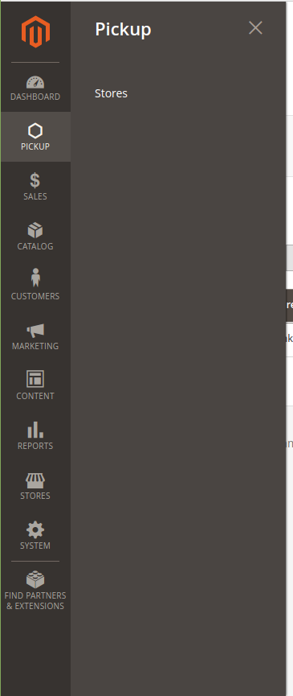
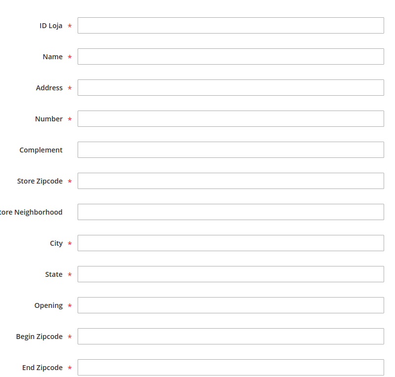
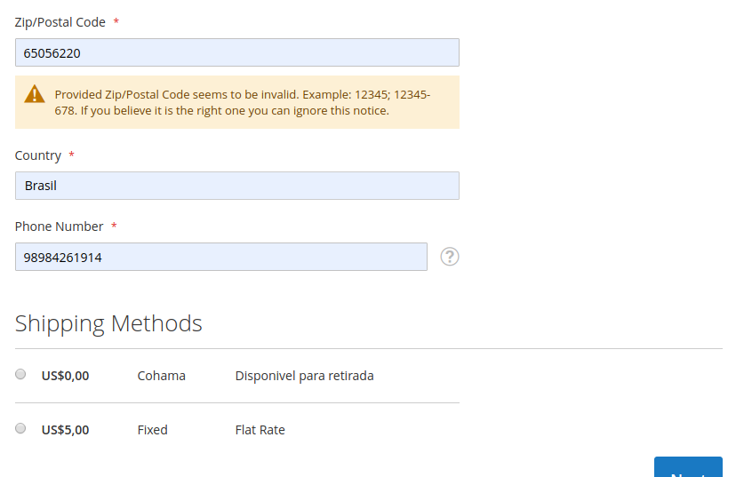

How Usage this
``` 
Copiar a pasta ithappens e colar no dentro da sua pasta code

bin/magento module:enable Ithappens_Pickup       // Ativa o módulo
bin/magento setup:upgrade                        // Registra a extensão
bin/magento setup:di:compile                     // Recompila o projeto Magento
```
Uso
Uma vez instalado e configurado, é necessário cadastrar as Lojas disponíveis para retirada bem como as Janelas de Coleta.



Cadastro das lojas é necessário informar o range de Cep em "Begin Zipcode" e "End Zipcode" que a loja vai atender, permitindo que você cadastre várias lojas, e que alguma pessoa de outro estado não consiga Solicitar retirada em loja por engano.
Caso no estado dela Exista uma loja que possua retirada, somente essa irá aparecer para o cliente final.



- **Id loja**: Id da loja 
- **Name**: Nome para a loja (Aparecerá para o cliente) 
- **Address**: Endereço da loja
- **Number**: numero da loja
- **Complement**: Complemento 
- **Store Zipcode**: Cep da loja
- **City**: Cidade da loja
- **State**: Estado da loja
- **Openning**: Horário em que a loja abre
- **Begin Zipcode**: Inicio do range de cep que a permitirá retirada (exemplo: 1000000)
- **End Zipcode**: Fim do range de cep que a permitirá retirada (exemplo: 9000000)

Exemplo do pickup store no frontend da loja:



